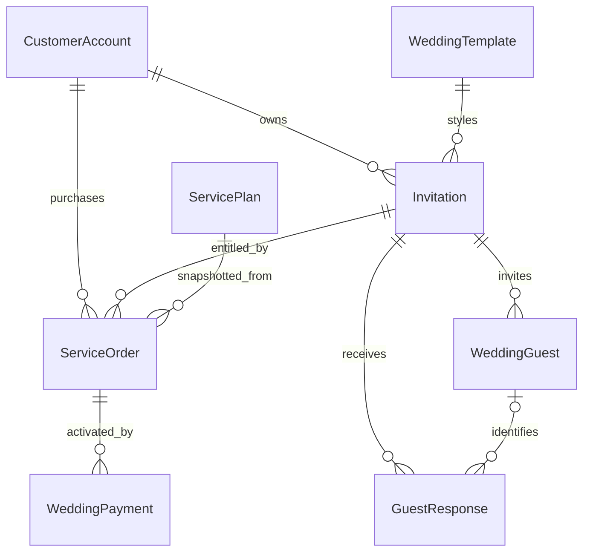

# Ngữ cảnh miền nghiệp vụ — Happy Wedding

Tài liệu này là bản đồ nhanh cho người tiếp quản. Đặc tả đầy đủ: [Wedding Platform Design](docs/superpowers/specs/2026-10-03-wedding-platform-design.md). Đối chiếu mã ngày 03/10/2026; không thay thế schema hoặc validation runtime.

## Ngôn ngữ chung

| Thuật ngữ                           | Ý nghĩa chính xác                                                                       |
| ----------------------------------- | --------------------------------------------------------------------------------------- |
| Mẫu thiệp / WeddingTemplate         | Cấu hình layout + palette; nhiều thiệp dùng chung; không phải một thiệp có cặp đôi thật |
| Thiệp / Invitation                  | Nội dung cưới của một chủ tài khoản; có slug, version và trạng thái                     |
| Tiệc / WeddingEvent                 | Một phần tử trong eventsJson gồm lịch/địa điểm; không phải record có ID riêng           |
| Gói dịch vụ / ServicePlan           | Bảng giá/quyền lợi đang bán; chưa phải quyền khách đã mua                               |
| Đơn / ServiceOrder                  | Snapshot gói của một thiệp, giá và thời hạn; pending/paid/cancelled                     |
| Quyền lợi / entitlement             | Một đơn paid còn hạn được chọn để cho phép xuất bản và giới hạn tài nguyên              |
| Giao dịch / WeddingPayment          | Bằng chứng kích hoạt đơn, có transactionId duy nhất; không phải tiền mừng               |
| Khách mua dịch vụ / CustomerAccount | Tài khoản đăng nhập sở hữu thiệp và đơn                                                 |
| Khách mời / WeddingGuest            | Lời mời cá nhân của một thiệp; không có tài khoản đăng nhập                             |
| RSVP / GuestResponse                | Phản hồi dự tiệc; attendance độc lập với trạng thái duyệt lời chúc                      |
| Xuất bản / publish                  | Cho phép truy cập công khai nếu các điều kiện khác còn hợp lệ                           |
| Thu hồi / unpublish                 | Chủ thiệp đưa published về draft, vẫn giữ dữ liệu và đơn                                |
| Tạm khóa / suspend                  | Admin khóa thiệp; chủ thiệp không thể tự vượt qua                                       |
| Mở khóa / restore                   | Admin đưa suspended về draft; không tự xuất bản                                         |
| Đã chuyển tiền                      | Ghi chú của khách; không phải xác nhận đã thu tiền                                      |

## Ranh giới dữ liệu

- Owner ID lấy từ phiên, không từ payload. Truy cập chéo chủ trả 404 ở ownedInvitation.
- Template/plan là catalog toàn hệ thống. Slug thiệp unique toàn hệ thống.
- WeddingGuest.token cho phép nhận diện lời mời; không cấp quyền sửa thiệp/xuất dữ liệu.
- RSVP không token dedupe theo UUID client; có token dedupe theo guest ID.
- Đơn đã mua giữ snapshot; admin sửa plan không làm thay đổi lịch sử.
- Gói hết hạn không đổi Invitation.status; public read tự kiểm tra expiry.
- Tiền mừng chỉ tạo QR tới tài khoản cặp đôi, không tạo WeddingPayment.

## Bản đồ mã

| Vùng            | File / thư mục                                                | Trách nhiệm                                             |
| --------------- | ------------------------------------------------------------- | ------------------------------------------------------- |
| Schema          | `prisma/schema.prisma`                                        | Quan hệ và uniqueness                                   |
| Input và format | `src/lib/wedding.ts`                                          | Zod, kiểu dữ liệu, giờ VN, giá, seed content            |
| Miền            | `src/server/wedding/service.ts`                               | Ownership, quyền lợi, save/publish, order/payment, RSVP |
| Guards          | `src/server/wedding/guards.ts`                                | Phiên, role, origin và rate-limit wedding               |
| API             | `src/app/api/wedding/[...path]/route.ts`                      | JSON mutation, admin catalog/settings, CSV              |
| Bank webhook    | `src/app/api/payments/sepay/route.ts`                         | Xác minh provider và gọi activation                     |
| Upload          | `src/app/api/wedding/upload/route.ts`                         | Giới hạn stream/decode, chuyển ảnh và lưu file          |
| Customer UI     | `src/app/dashboard/`, `src/components/wedding/`               | Editor, mua gói, guest dashboard                        |
| Public UI       | `src/app/w/[slug]/page.tsx`                                   | Kiểm tra quyền công khai và render thiệp                |
| Admin UI        | `src/app/admin/`                                              | Catalog, đơn, khách, suspension, settings và audit      |
| Operations      | `scripts/setup.ts`, `scripts/backup.py`                       | DB riêng, admin local, backup                           |
| Regression      | `tests/server/wedding/service.test.ts`, `e2e/wedding.spec.ts` | Domain và luồng end-to-end                              |

## Những điểm dễ hiểu sai

Không hợp nhất quyền lợi giữa nhiều đơn: hiện chọn maxPhotos cao nhất rồi expiry dài nhất. Sau RSVP chỉ chặn thay **số lượng** tiệc; không tự phát hiện đổi thứ tự. Không có cleanup upload/retention tự động. Audit payment nguyên tử; không phải mọi audit admin đều nguyên tử. Chưa có CI workflow GitHub Actions trong repo; kiểm tra hiện chạy local qua pnpm và hooks.

Khi sửa các quy tắc này, cập nhật spec, test và [ADR](docs/adr/README.md) cùng commit nghiệp vụ. Chưa có tính năng mở rộng nào được ngầm coi là đã giao.
