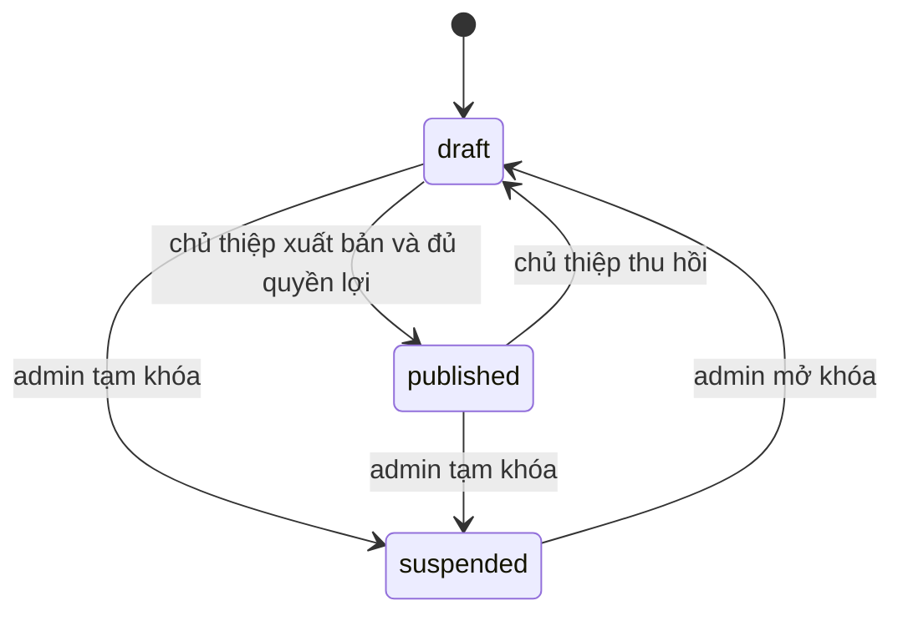
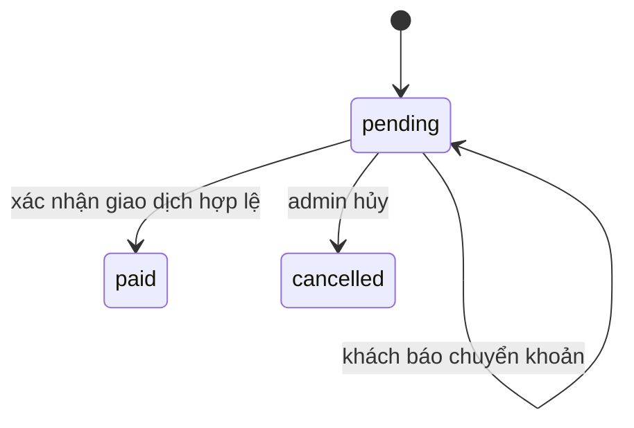
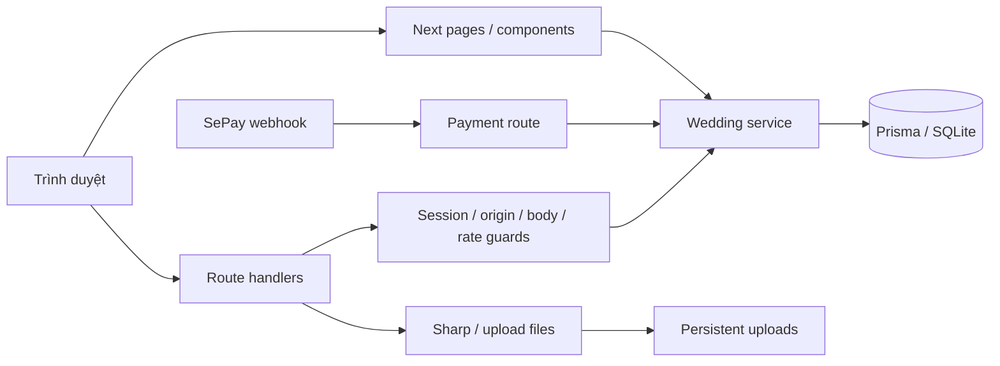

# Wedding Platform — Product & Design Specification

Ngày đối chiếu: 03/10/2026. Baseline mã: `53bea9c` trên `main`.

## 1. Trạng thái và nguồn yêu cầu

Đây là đặc tả được bổ sung **sau triển khai**, theo cấu trúc design/spec của Superpowers. Nội dung đối chiếu mã hiện tại, yêu cầu của chủ dự án và nghiên cứu trong [RESEARCH](../../RESEARCH.md). Không khẳng định dự án đã thực hiện brainstorming, phê duyệt thiết kế hoặc TDD trước khi xây. Người dùng đã yêu cầu bổ sung và commit/push tài liệu; chưa chốt thương hiệu, giá bán, chính sách hoặc thông tin đám cưới thật.

Mục tiêu: làm thiệp cưới cho anh trai chủ dự án, đồng thời bán dịch vụ thiệp online cho các cặp đôi khác. Dự án clone `my_task`, giữ nền xác thực/bảo vệ HTTP, thay miền bán hàng/POS bằng miền cưới. Hai mẫu tham khảo chỉ cung cấp ý tưởng trải nghiệm; không sao chép mã, ảnh hay thông tin riêng của cặp đôi.

## 2. Vai trò và kết quả cần đạt

| Vai trò             | Kết quả                                                           | Phạm vi quyền                                               |
| ------------------- | ----------------------------------------------------------------- | ----------------------------------------------------------- |
| Người xem website   | Chọn mẫu, xem preview, xem giá                                    | Catalog công khai; preview không gửi RSVP                   |
| Khách mua dịch vụ   | Tạo, sửa, thanh toán và xuất bản thiệp                            | Thiệp, đơn, khách mời và phản hồi thuộc tài khoản mình      |
| Khách dự cưới       | Đọc thông tin, chọn tiệc, RSVP và gửi lời chúc                    | Thiệp công khai hợp lệ; token riêng chỉ xác định lời mời đó |
| Admin owner/manager | Quản lý catalog, xác nhận tiền, khóa thiệp/tài khoản, xem nhật ký | Cần phiên admin hợp lệ tại server                           |

Role `staff` tồn tại trong schema kế thừa nhưng không được quyền thực hiện mutation quản trị wedding. Không có hệ thống phân quyền tùy chỉnh hoặc giao diện tạo nhiều quản trị viên trong bản đầu.

## 3. Phạm vi và ràng buộc toàn dự án

- Node 22; pnpm 10.28.2; Next.js 16.3.8; React 19.2.4; Prisma 6.19.3; Zod 4.
- Văn bản hướng tới khách hàng bằng tiếng Việt; hiển thị giờ theo `Asia/Ho_Chi_Minh`.
- Tiền dùng integer VND. Giá/quyền lợi của đơn được snapshot từ server.
- Production một Node instance, SQLite và uploads trên volume bền vững.
- Không commit `.env`, `.local-admin-password`, DB hoặc ảnh khách tải lên.
- Phiên khách và admin tách riêng; quyền sở hữu được kiểm tra tại server.
- Thiệp công khai cần `published`, chủ tài khoản đang hoạt động và gói `paid` chưa hết hạn.
- Tiền mua dịch vụ và tiền mừng cưới là hai luồng độc lập.
- Commit từng phần đã kiểm tra, push vào `origin` của `happy_wedding`; không push vào `base`.

Không thuộc bản đầu: kéo-thả tự do, video, tên miền riêng từng thiệp, OTP, khôi phục mật khẩu tự phục vụ, gửi SMS/email/Zalo, tự động hoàn tiền, nhập Excel, analytics, AI viết nội dung, bán thiệp in và nhiều instance.

## 4. Ba phân hệ

### A. Catalog, tài khoản và biên tập thiệp

Trang chủ giới thiệu dịch vụ. `/templates` hỗ trợ tìm kiếm và lọc; `/templates/[slug]` mô tả mẫu; `/preview/[slug]` xem thiệp minh họa. Năm layout `editorial`, `botanical`, `classic`, `minimal`, `cinematic` kết hợp sáu palette `rose`, `sage`, `wine`, `sand`, `midnight`, `terracotta`; seed tạo mười mẫu. Minimal là thư mời chữ trước/ảnh ngang, cinematic là ảnh phủ khung và bảng chữ nền đặc. Editor có link mở preview minh họa của mẫu đang chọn; preview nội dung khách vẫn dùng bản đã lưu. Admin quản lý cấu hình mẫu, chưa có trình thiết kế HTML/CSS tùy ý.

Khách đăng ký bằng số điện thoại và mật khẩu tối thiểu 10 ký tự. Số được chuẩn hóa; chưa xác minh quyền sở hữu số qua OTP. Thông báo đăng ký tránh tiết lộ tài khoản tồn tại. Đăng nhập xong khách dùng dashboard; liên kết chọn mẫu được giữ qua chuyển hướng đăng nhập an toàn.

Thiệp có tên hai người, ngày cưới, tiêu đề, câu chuyện, gia đình, 1–4 tiệc, ảnh bìa, album, nhạc HTTPS tùy chọn và hai tài khoản ngân hàng mừng cưới nhà trai/nhà gái tùy chọn. Mỗi bên điền đủ ngân hàng, tài khoản, chủ tài khoản hoặc bỏ trống; mã QR có nút sao chép tài khoản và mở ảnh để lưu, thông tin chuyển khoản vẫn đọc được khi QR lỗi. Slug duy nhất, chữ thường/số/gạch ngang, dài 3–80. Slug của thiệp đã xuất bản chỉ đổi sau khi thu hồi.

Mỗi tiệc có `title`, `date`, `venue`, `address`. Lịch, Maps và lựa chọn RSVP dùng cùng mảng tiệc. Input datetime local được đổi sang ISO với offset Việt Nam; lưu DateTime trong DB. Mảng tiệc/ảnh lưu JSON có Zod kiểm tra lúc đọc và ghi.

Bản nháp tối đa 12 ảnh; gói trả phí có giới hạn snapshot 1–40. Upload yêu cầu phiên và thiệp đã lưu thuộc chủ tài khoản; nhận JPG/PNG/WebP tối đa 5 MB, decode tối đa 40 megapixel, chuyển WebP và loại metadata. Ảnh phục vụ qua URL công khai. Nhạc chỉ phát khi người xem chủ động bật.

Mỗi lần sửa tăng `version`. Lưu với version cũ trả 409 để tránh ghi đè. Thiệp bị admin suspend không được sửa hoặc tự xuất bản. Khi đã có RSVP, không thay số lượng tiệc; thứ tự tiệc phải được giữ để `eventIndex` tiếp tục trỏ đúng. Hiện không có ID ổn định riêng cho từng tiệc.

### B. Đơn dịch vụ, thanh toán và quản trị

`/pricing` đọc gói active. Bảng so sánh và trang mua gói dùng cùng catalog: giá, thời hạn, số ảnh, mẫu cao cấp, thương hiệu. Phần tiện ích chung giải thích QR hai bên, lịch tiệc, RSVP, lời mời riêng và CSV. FAQ nói rõ bản nháp 12 ảnh, thời hạn từ lúc xác nhận và gia hạn không cộng dồn quyền lợi hay trừ tiền gói cũ. Thẻ mẫu có liên kết trực tiếp tới thiệp preview đầy đủ; chi tiết không gắn quyền mẫu cao cấp vào tên gói cố định. Seed tạo 199.000/399.000/699.000 VND, thời hạn 12/18/36 tháng, số ảnh 12/24/40. Đây là dữ liệu khởi tạo, chưa phải bảng giá chủ dịch vụ xác nhận.

Mua gói gắn với một thiệp của tài khoản. Server đọc plan active và snapshot `planName`, `total`, `months`, `maxPhotos`, `premiumTemplates`, `removeBranding`. `clientId` UUID hỗ trợ retry; cùng ID nhưng khác tài khoản/thiệp/gói trả 409. Một đơn pending cùng tài khoản/thiệp/gói được tái sử dụng. Mã chuyển khoản dạng `HY` + 12 hex.

Ngân hàng nhận tiền dịch vụ cấu hình tại `/admin/settings`; để trống thì không tạo QR ngân hàng giả. Bấm báo đã chuyển chỉ cập nhật `paymentNote`; đơn vẫn pending.

Admin xác nhận bằng mã giao dịch sao kê và số tiền đúng tuyệt đối. `confirmPayment` là đường duy nhất kích hoạt: transaction kiểm tra giao dịch duy nhất, ghi `WeddingPayment`, chuyển order thành paid, tính expiry và ghi audit. Sai số tiền hoặc đơn cancelled không kích hoạt. Retry cùng giao dịch không cộng thời hạn hai lần; giao dịch đã dùng cho đơn khác trả 409. Với đơn đã paid, lần xác nhận mới trả đơn hiện tại và không ghi thêm khoản tiền; chưa có đối soát khoản trả thừa/hoàn tiền.

Gia hạn cộng tháng UTC sau expiry còn hiệu lực dài nhất, hoặc sau thời điểm thanh toán nếu không còn gói. Quyền hiện tại chọn một order paid còn hạn theo `maxPhotos` giảm dần, sau đó `expiresAt` giảm dần; **không hợp nhất quyền của nhiều order**. Khi thay quy tắc nâng/hạ gói phải có đặc tả riêng.

Cấu hình thanh toán dịch vụ có chọn ngân hàng, QR xem trước và liên hệ điện thoại/email trực tiếp trên đơn; khi QR không tải được vẫn hiện thông tin chuyển khoản và nút thử lại. Không dùng tài khoản mừng cưới cho thanh toán dịch vụ.

SePay là tùy chọn. Tài khoản nhận tiền đã lưu phải khớp cấu hình máy chủ; thay đổi làm webhook tạm ngừng (503) cho tới khi đồng bộ. Endpoint xác minh API key thời gian hằng, đúng tài khoản, tiền vào, mã đơn và số tiền. Giao dịch không thuộc đơn hợp lệ được acknowledge và bỏ qua; thiếu cấu hình trả 503; API key sai trả 401; sai số tiền trả 400. Dùng `sepay:<id>` cho idempotency. Chưa kiểm chứng tài khoản sandbox/live của chủ dự án.

Admin có dashboard, đơn/bộ lọc, catalog, khách hàng, thiệp, settings và audit. Khóa tài khoản thu hồi phiên và ẩn các thiệp; mở lại tài khoản không tự phục hồi phiên. Suspend thiệp tăng version; restore về draft. Đổi giá hoặc ngừng bán gói không đổi snapshot cũ. Ngừng cung cấp mẫu không ẩn thiệp đang dùng; không được đổi premium của mẫu có thiệp published.

### C. Thiệp công khai, khách mời và RSVP

`/w/[slug]` tra cứu điều kiện công khai ở server. Hết hạn được ẩn ngay lúc đọc; không cần cron đổi `status`. Có tên cặp đôi, gia đình, câu chuyện, đếm ngược, tiệc/bản đồ/thêm lịch, album, nhạc, lời chúc đã duyệt và QR mừng cưới.

Thiệp và preview mở đầu bằng hai cánh cửa theo palette, tên cặp đôi, ngày cưới và tên khách (nếu có). Nút “Mở thiệp” hoặc Escape mở cửa, trả focus vào tiêu đề và mới bắt đầu hiệu ứng nội dung; reduced motion mở ngay, không JavaScript vẫn đọc thiệp trực tiếp.

Thiệp và preview giữ nguyên phối màu; phần mở đầu/nội dung hiện lần lượt khi vào viewport, ảnh bìa zoom chậm, trang trí nhẹ theo layout. Album mở bằng dialog, hỗ trợ nút trước/sau, phím mũi tên, Escape và trả focus về ảnh đã chọn. Hiệu ứng là progressive enhancement: nội dung server vẫn đọc được khi chưa có JavaScript; chế độ giảm chuyển động tắt CSS animation và animation qua Web Animations API. Nhạc chỉ phát khi khách chủ động bật.

Responsive giữ điều hướng chính hiển thị trên mobile, tăng vùng bấm và cỡ chữ form lên 16px ở ≤800px. Bố cục, ảnh bìa, countdown, tên dài, QR và album thích nghi từ 320px tới desktop; màn mở thiệp thu gọn khi xoay ngang. Dashboard dùng header xuống dòng, bảng rộng cuộn trong vùng bảng, không che nội dung bằng header cố định trên điện thoại.

Chủ thiệp tạo tối đa 2.000 lời mời cá nhân, mỗi lời mời có tên, nhóm và token ngẫu nhiên 24 byte. URL cá nhân có query `guest`; token là capability dùng để tra lời mời, không phải tài khoản và không cấp quyền dashboard. Không log token; referrer policy `no-referrer`. Mẫu preview và thiệp demo được phân biệt rõ với thiệp thật.

RSVP gồm UUID client, tên, attendance (`attending`, `declined`, `undecided`), số người 1–10, tiệc theo index và lời nhắn tối đa 1.000 ký tự. Index phải trỏ đến tiệc tồn tại. Không attending thì lưu partySize bằng 0. Có token riêng thì dùng guest ID làm khóa ổn định qua thiết bị; không có token thì dùng client UUID, không bảo đảm dedupe khi đổi trình duyệt/xóa dữ liệu local.

Unique `(invitationId, clientId)` khiến retry cập nhật một phản hồi. Mọi lần gửi/cập nhật đặt lời chúc về pending. Chủ thiệp duyệt approved hoặc hidden; công khai chỉ thấy approved. Chủ thiệp xem danh sách có phân trang và xuất tối đa 10.000 phản hồi CSV; escape dấu nháy và vô hiệu prefix công thức. CSV xuất phản hồi, không phải toàn bộ khách chưa RSVP.

## 5. Trạng thái và điều kiện truy cập

Hết hạn gói/khóa chủ tài khoản là điều kiện ẩn khi đọc; không phải trạng thái thiệp mới.

Không có transition paid → cancelled/refunded qua API hiện tại. Lời chúc độc lập với attendance: pending → approved/hidden; gửi lại → pending.

## 6. Kiến trúc và dữ liệu

Pages đọc dữ liệu tại server; browser gọi API cho mutation. Một số thao tác admin/catalog nằm trực tiếp trong route handler, chưa tất cả được gom vào service. Session và middleware bảo vệ URL không thay thế kiểm tra quyền ở route/domain.

| Entity                            | Trách nhiệm và liên kết                                         |
| --------------------------------- | --------------------------------------------------------------- |
| CustomerAccount / CustomerSession | Chủ thiệp, số điện thoại duy nhất, phiên có thể thu hồi         |
| AdminIdentity / AdminSession      | Danh tính, role, version và phiên quản trị                      |
| WeddingTemplate                   | Layout/palette, active, premium; liên kết nhiều thiệp           |
| ServicePlan                       | Catalog giá/quyền lợi hiện tại                                  |
| Invitation                        | Thuộc một customer/mẫu; slug unique; version; nội dung/tiệc/ảnh |
| ServiceOrder                      | Thuộc customer/thiệp/plan; snapshot và thời hạn                 |
| WeddingPayment                    | Thuộc order; transaction ID globally unique có prefix provider  |
| WeddingGuest                      | Thuộc thiệp; token unique; tên và nhóm                          |
| GuestResponse                     | Thuộc thiệp, guest tùy chọn; RSVP và moderation                 |
| AdminAuditEvent / Setting         | Lưu quyết định quản trị và cấu hình merchant                    |

Schema dùng String cho trạng thái, không có enum/check constraint DB cho các giá trị nghiệp vụ. Validation hiện thuộc Zod/domain. Audit payment và khóa khách nằm cùng transaction; một số audit admin khác ghi sau mutation, chưa bảo đảm nguyên tử cho tất cả thao tác.

## 7. Hợp đồng và an toàn

Hợp đồng request, response và quyền tại [API-CONTRACTS](../../API-CONTRACTS.md). HTTP guards chặn origin không tin cậy, JSON body quá lớn, thiếu phiên, truy cập chéo chủ thiệp và rate-limit. Không tin price/status/ownerId từ browser. Production yêu cầu Redis/HMAC/origin/proxy hợp lệ, fail closed; build placeholder không dùng làm runtime cấu hình.

Không đưa hash/token/API key/nội dung riêng vào log. UI thông báo lỗi miền bằng tiếng Việt; lỗi ngoài dự kiến chỉ trả thông báo chung/correlationId. Secret chỉ nằm môi trường, không trong admin settings hoặc Git.

SQLite là giới hạn triển khai: không writer phân tán, transaction ngắn, chỉ gọi `tx` bên trong interactive transaction. Backup SQLite online + ảnh; cần tạm dừng ghi nếu muốn snapshot DB/ảnh đồng nhất. Chưa có retention tự động, xóa tài khoản tự phục vụ hoặc cleanup ảnh mồ côi.

## 8. Nghiệm thu và bằng chứng

| ID  | Tiêu chí                                                     | Mã/bằng chứng                                               |
| --- | ------------------------------------------------------------ | ----------------------------------------------------------- |
| A1  | Chọn mẫu, giữ lựa chọn qua đăng nhập, tạo/sửa preview        | `src/app/dashboard/new/page.tsx`, `e2e/wedding.spec.ts`     |
| A2  | Lưu bảo vệ owner/version/slug; giới hạn ảnh                  | `saveInvitation`, `tests/server/wedding/service.test.ts`    |
| A3  | Upload ảnh thật trong editor; mobile không cuộn ngang        | upload route, browser journey                               |
| B1  | Snapshot giá và retry order không nhân đôi                   | `createServiceOrder`, domain tests                          |
| B2  | Báo chuyển khoản không tạo quyền; xác nhận admin mới có paid | API payment-note, browser journey                           |
| B3  | Exact amount, unique transaction, retry, gia hạn             | `confirmPayment`, domain tests                              |
| B4  | Webhook key/tài khoản/hướng tiền/mã đơn đúng                 | SePay route, webhook tests; chưa phải bank integration live |
| B5  | Khóa chủ/thiệp có tác dụng và không bị owner vượt qua        | guards/service/admin route, domain tests                    |
| C1  | Unpaid/draft/expired không công khai hoặc nhận RSVP          | `publicInvitation`, domain tests                            |
| C2  | Personal RSVP ổn định, moderation pending, index hợp lệ      | `submitResponse`, domain/browser tests                      |
| C3  | Duyệt lời chúc rồi công khai; CSV chỉ của owner              | browser journey và export route review                      |

Kết quả test/build đã ghi ở [VERIFICATION](../../VERIFICATION.md), thuộc lần kiểm tra ứng dụng trước lượt bổ sung docs. Lượt tài liệu này chỉ xác minh đường dẫn, nội dung đối chiếu, formatting và Git; không tuyên bố đã chạy lại toàn bộ ứng dụng.

## 9. Việc còn cần trước mở bán

| Việc                         | Người cung cấp/quyết định     | Điều kiện hoàn thành                                                              |
| ---------------------------- | ----------------------------- | --------------------------------------------------------------------------------- |
| Nội dung cưới thật           | Chủ dự án/cặp đôi             | Tên, gia đình, lịch/địa chỉ và ảnh được phép dùng; gia đình duyệt trên điện thoại |
| Thương hiệu, giá, chính sách | Chủ dịch vụ                   | Chốt tên/giá/hạn lưu/hoàn tiền, thay trang chính sách dự thảo                     |
| Ngân hàng dịch vụ/mừng cưới  | Hai chủ tài khoản tương ứng   | Đúng BIN, số tài khoản và tên; QR được đọc bằng app ngân hàng                     |
| SePay tùy chọn               | Chủ tài khoản ngân hàng/SePay | Sandbox đúng/sai/retry; đối soát tiền và audit                                    |
| Production                   | Chủ hạ tầng                   | Domain/HTTPS, secret, Redis, volume, backup/restore và smoke test                 |

Những việc này chưa đánh dấu hoàn tất và không được quảng cáo đã hoạt động. Kế hoạch tiếp tục nằm tại [plans](../plans/2026-10-03-catalog-editor-plan.md), [commerce](../plans/2026-10-03-commerce-admin-plan.md), [guest-publication](../plans/2026-10-03-guest-publication-plan.md).

### Dashboard quản trị mở rộng (03/10/2026)

Dashboard `/admin` dùng period 7/30/90 ngày gần nhất (mặc định 30), ngày theo Asia/Ho_Chi_Minh, kỳ này gồm hôm nay và so với kỳ liền trước đủ ngày. Tiền đã nhận lấy WeddingPayment.amount/receivedAt, không cộng đơn pending, ghi chú khách, tiền mừng hoặc thiệp demo. Có tổng toàn thời gian, biểu đồ đường tương tác/chọn ngày và bảng số liệu, doanh số theo tên gói snapshot, trạng thái khách/thiệp/catalog và tác vụ cần xử lý. Thiệp đang công khai phải có owner bật và paid entitlement còn hạn; số thiệp status published không đủ chứng minh còn công khai. Danh sách khách lọc theo tên/điện thoại/trạng thái, thống kê hoạt động/khóa, số đơn paid và tiền gói đã trả, giữ bộ lọc khi phân trang.
